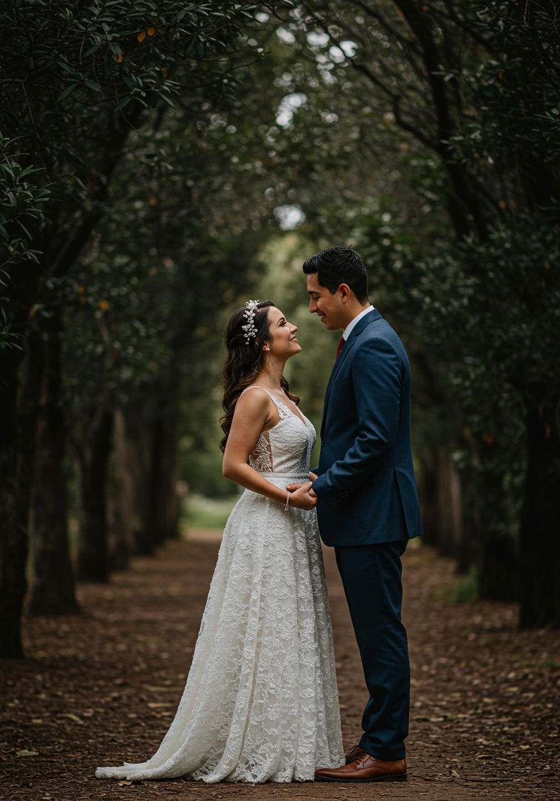
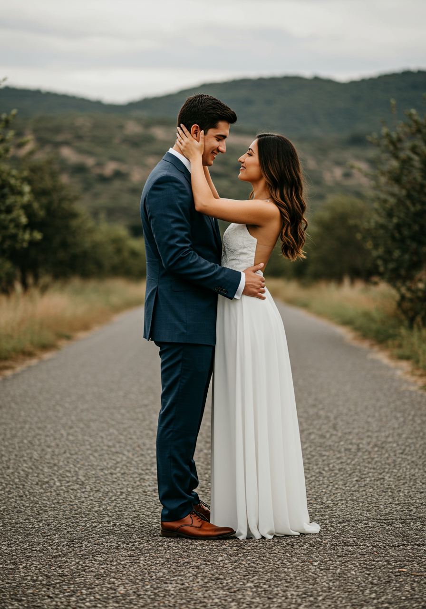

import Hero from "../../components/bodas/Hero-elegante.jsx";
import Encabezados from "../../components/bodas/Encabezados.astro";
import Audio from "../../components/bodas/Audio.astro";
import Padres from "../../components/bodas/Padres.astro";
import Pases from "../../components/bodas/Pases";
import ProgresoInvitados from "../../components/comunes/ProgresoInvitados.astro";
import MensajeVip from "../../components/comunes/MensajeVip.astro";
import ParrafosLibres from "../../components/bodas/ParrafosLibres.astro";
import Frase from "../../components/bodas/Frase.astro";
import Detalles from "../../components/bodas/Detalles.astro";
import Galeria from "../../components/bodas/Galeria.astro";
import SliderGsap from "../../components/comunes/SilderGsap.astro";
import SliderVentana from "../../components/comunes/SliderVentana.astro";
import BloqueMapa from "../../components/bodas/BloqueMapa.astro";
import Regalos from "../../components/bodas/Regalos.astro";
import Contador from "../../components/bodas/Contador.astro";
import Confirmacion from "../../components/comunes/Confirmacion";
import Footer from "../../components/bodas/Footer.astro";
import Itinerario from "../../components/bodas/Itinerario.astro";
import FotoSolitaria from "../../components/comunes/FotoSolitaria.astro";
//importamos las imagenes solitarias que van entre las secciones
import foto1 from '../../assets/bodas/nvitaPlus/gale/fotosolitaria-1.png';
import foto2 from '../../assets/bodas/nvitaPlus/gale/fotosolitaria-2.png';
 
 <Hero
    nombres={frontmatter.novios}
    fecha={frontmatter.fecha}
    ellaIniciales={frontmatter.ellaIniciales}
    elIniciales={frontmatter.elIniciales}
    cover={frontmatter.cover}
    tema={frontmatter.theme}
    client:load
  /> 

<section class="grid contenido">
  <Audio src="/bodas/nvitaPlus/love-story" />
</section>

<section class="grid pantalla">
  <Padres
    mamaNovia={frontmatter.padres.mamaNovia}
    papaNovia={frontmatter.padres.papaNovia}
    fotopapasNovia={frontmatter.padres.fotopapasNovia}
    mamaNovio={frontmatter.padres.mamaNovio}
    papaNovio={frontmatter.padres.papaNovio}
    fotopapasNovio={frontmatter.padres.fotopapasNovio}
  />
</section>

<section class="grid contenido">
  

    <BloqueMapa
      encabezado="Ceremonia"
      dir={frontmatter.ceremonia.lugar}
      horario={frontmatter.ceremonia.hora}
      lat={frontmatter.ceremonia.lat}
      lng={frontmatter.ceremonia.lng}
      mapName="mapa1"
      icono="iglesia"
    />
    <BloqueMapa
      encabezado="Recepción"
      dir={frontmatter.recepcion.lugar}
      horario={frontmatter.recepcion.hora}
      lat={frontmatter.recepcion.lat}
      lng={frontmatter.recepcion.lng}
      mapName="mapa2"
      icono="brindis"
    />
  

</section>

<FotoSolitaria arriba={false}gradientePorciento={30} src={foto1} />

<Pases folder={frontmatter.json} client:load />

<section class="grid contenido">

  <Contador fecha={frontmatter.fecha} />
</section>
<ProgresoInvitados
  email="nvitaplusboda@nvita.me"
  porcentajeMostrarInvitados={20}
  frase="Estás en la lista, ¿Ya confirmaste?"
  mostrarSiempre={true}
/>

<section class="grid contenido">
  <Frase frase={frontmatter.frase_amor} />
</section>
<FotoSolitaria arriba={true}gradientePorciento={30} src={foto2} />

<section class="grid pantalla" id="BaseItinerario">
  <Encabezados texto="Itinerario" />
  <Itinerario listado={frontmatter.iterario} />
</section>

<section class="grid pantalla flex margen-arriba-abajo">
  <Detalles lista={frontmatter.consideraciones} encabezado="Consideraciones" />
  <Detalles encabezado="Codigo de vestir" vestimenta={frontmatter.vestimenta} />
</section>

<section class="grid pantalla">
  <SliderVentana>
    
 

    

 
    
 

    
 

  </SliderVentana>
</section>

<section class="grid contenido">

  <Regalos
      frase={frontmatter.frase_regalos}
      beneficiario={frontmatter.beneficiario}
      banco={frontmatter.banco}
      cuenta={frontmatter.cuenta}
    />
</section>

<section class="grid contenido">
  <MensajeVip />
</section>

<Confirmacion
  whatsapp={frontmatter.whatsapp}
  dias_antes={15}
  version={frontmatter.version}
  tipoEvento="boda"
  client:only="react"
/>

